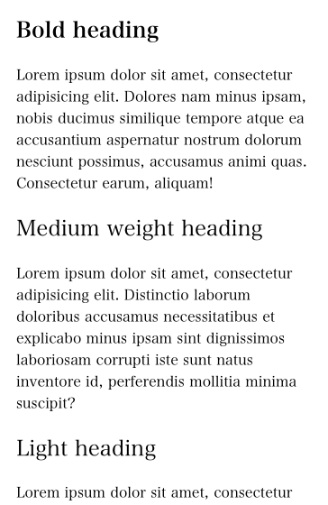
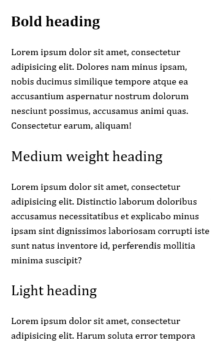
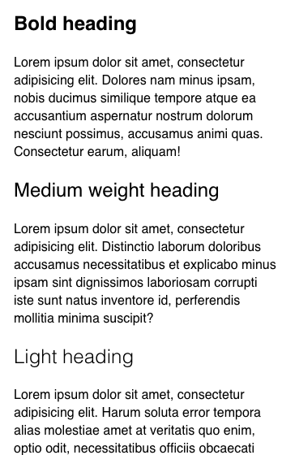
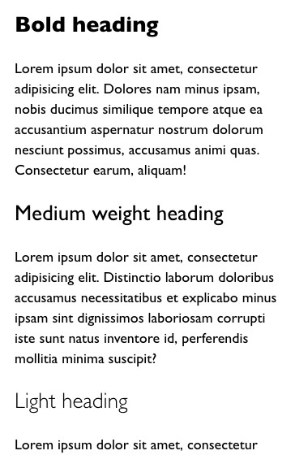
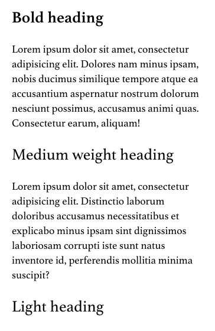
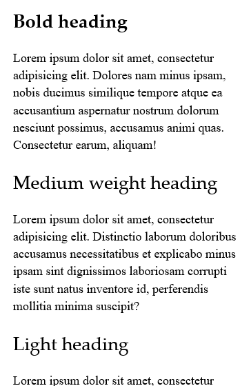

import BigImage from "../../src/components/big-img"
import ImageRow from "../../src/components/img-row"

<BigImage>


</BigImage>

When the `@font-face` directive (which allows the use of non-system font files on webpages) made its [official debut][423c2466] in the CSS3 fonts module, Flash was still a big part of the web. Compared to CSS at the time, Flash allowed for seemingly limitless possibilities in layout, typography, animations and consistency across platforms.  It was extremely attractive to adopt with its relatively shallow learning curve and gave designers a more visual way to put content on the web.

A lot of folks (myself included) developed a palpable distaste for Flash-based sites as they were often slow to load, relied on a locally installed plugin, and often were a black box of content that was inaccessible to a large chunk of the web’s users. `@font-face` was just the thing CSS needed if was going to seriously compete with Flash and become adopted as part of the modern (and standard) way to build websites. HTML + CSS offered a more extensible and accessible way to present content and with the addition of features like `@font-face` we could start to see a future where the aesthetic consistency of Flash could be replicated with CSS.

I started experimenting with web fonts in 2007 after reading [CSS @ Ten: The Next Big Thing][039e80cc].
Ten years prior, [this CSS2 draft from 1997][5ad770fe] mentions the `@font-face` directive but it was removed in the [CSS2.1 spec][964be9d5].

🎉 _Fun fact: Internet Explorer was the first browser to implement web fonts with @font-face, back in version 4 (1997)._

  [964be9d5]: https://www.w3.org/TR/CSS21/ "Cascading Style Sheets Level 2 Revision 1 (CSS 2.1) Specification"
  [5ad770fe]: https://www.w3.org/TR/WD-CSS2-971104/cover.html "CSS 2 Specification - W3C Working Draft 04-November-1997"
  [039e80cc]: http://alistapart.com/article/cssatten "CSS @ Ten: The Next Big Thing"
  [423c2466]: https://www.w3.org/TR/2001/WD-css3-fonts-20010731/ "CSS3 module: Fonts, W3C Working Draft 31-July-2001"

The web is now available on any capable device, largely thanks to the adoption of mobile-friendly web design (like responsive), the downfall of Flash as a web technology, and a user base glued to their phones reading Facebook at any given time. This has forced those who build web pages to consider performance impacts (load time, render time, etc..) more than ever before &mdash; or at least since the days of dialup when that draft was written in 1997.

Like images, JavaScript, and CSS bloat; web fonts can easily become performance bottlenecks if not kept in check. While they allow for consistency in typography across devices and platforms, concern for performance and accessibility over pixel-perfect consistency is a valid reason to think twice before using them.

Today, there are some newer fonts available that make setting type with system fonts on the web a little nicer. Since 1997, major OSs now ship with (and continue to release) native system fonts that can be easily adopted using a few stylesheet hacks and some carefully planned fallbacks.

Let me preference this list by saying that I am not anti-webfont and I think the technology was/is a huge step forward for CSS. I do think there is still work to be done when it comes to how browsers load these resources as it can lead to user experience issues like [FOIT (flash of invisible text)][5038a6bd]. Likewise, this list is experimental and hasn't been tested on many devices beyond recent OSX / Android / and Windows 7+ devices. These stacks can work independently or in conjunction with web fonts and hopefully will be useful for folks looking for alternatives.

[5038a6bd]: https://css-tricks.com/fout-foit-foft/ "FOUT, FOIT, FOFT"

## 1. The modern serif

A modern and more humanist serif stack ideal for both body and display sized text.

```css
body {
  font-family: "Hiragino Mincho Pro", Cambria, "Roboto Serif", serif;
  font-size: 16px;
  line-height: 1.4;
}
```

On the Apple side of things, we're using a font intended for a Japanese character set which includes good support for latin characters. I think this is a hidden gem on Apple's OSes that isn't used nearly enough.

-   macOS / OS X / iOS - **Hiragino Mincho Pro**
-   Windows 7 and up - **Cambria**
-   Android / ChromeOS - **Roboto Serif**
-   Falls back to - **local serif**

<ImageRow>





</ImageRow>


## 2. The Helvetica / Arial alternative

Modern sans stack suitable for UI and body copy. A variety of weights (with a light option on most operating systems).

```css
body {
  font-family: -apple-system, BlinkMacSystemFont, "Segoe UI", Roboto, Helvetica, Arial, sans-serif;
  font-size: 16px;
  line-height: 1.4;
}
```

You might have seen this type of stack used on Medium, GitHub, and Facebook recently.

-   macOS / OS X / iOS - **San Francisco**
-   Windows 7 and up - **Segoe UI**
-   Android / ChromeOS - **Roboto**
-   Falls back to - **Helvetica, Arial, local sans serif**

If you want to stay strictly with neo-grotesque typefaces, you could pull out `Segoe UI` font to allow Windows to render the fall back (Arial). Segoe UI is one of the only default fonts on Windows that has a light weight option, which makes it useful in many display sized contexts.

<ImageRow>




</ImageRow>

## 3. The humanist sans

A humanist sans stack that works best with body copy set above 18px.

```css
body {
  font-family: "Gill Sans", "Segoe UI", "Lucida Grande", Calibri,  sans-serif;
  font-size: 18px;
  line-height: 1.4;
}
```

-   macOS / OS X / iOS - **Gill Sans**
-   Windows 7 and up - **Segoe UI**
-   Android / ChromeOS - **Roboto**
-   Falls back to - **Lucida Grande, Calibri, local sans serif**

<ImageRow>




</ImageRow>

## 4. Classical serif

A traditional serif stack suitable optimized for legibility in body copy.

```css
body {
  font-family: Athelas, "Times New Roman", serif;
}

h1,
h2,
h3 {
   font-family: Athelas, "Palatino Linotype", "Times New Roman", serif;
}
```

Here we are only using `Palatino Linotype` for display sized headings on Windows machines as I find it hard to read at small sizes on lower resolution displays.

-   macOS / OS X / iOS - **Athelas**
-   Windows 7 and up - **Palatino Linotype** for headings and **Times New Roman** for body
-   Android / ChromeOS - **Roboto Serif**
-   Falls back to - **local serif**

<ImageRow>





</ImageRow>

### Suggestions or additions?

If you have suggestions or additions to the stacks above, [open an issue on this site's GitHub repo][c20fa7d6] and I'll update or append them to this list.

  [c20fa7d6]: https://github.com/pmarsceill/this-modern-web/issues/new "Open an Issue on GitHub"
